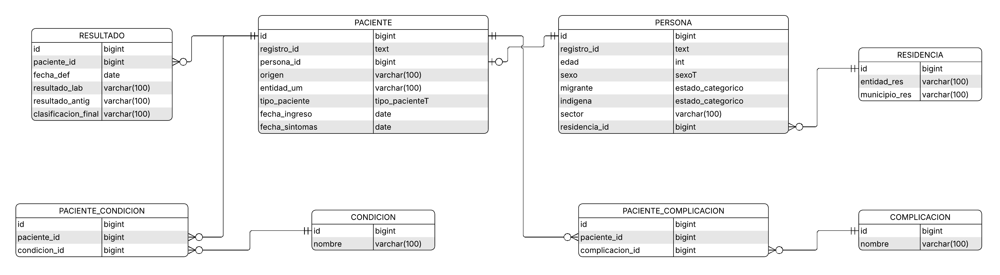
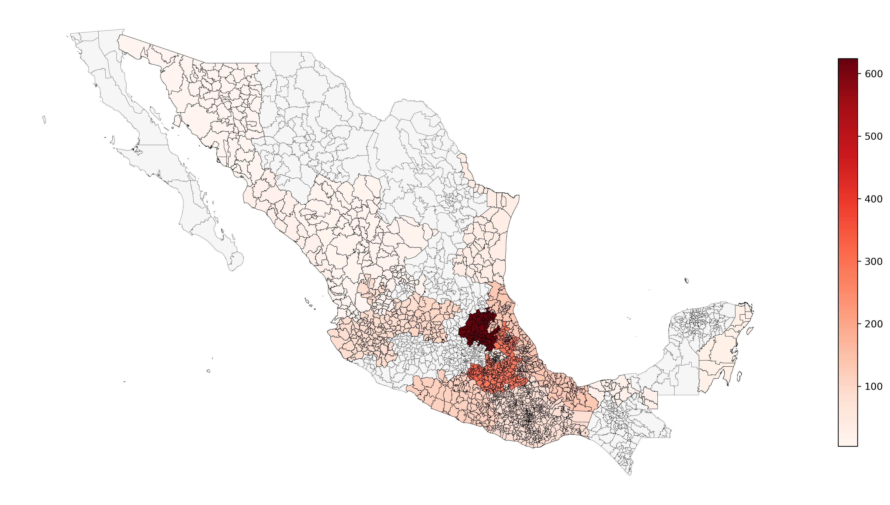

# Proyecto BD: Casos Nacionales COVID 2° Semestre 2022

## Integrantes

| Nombre Completo | Clave Única | GitHub |
| :--- | :--- | :--- |
| Cristopher Gongora Sanchez Castellanos | 218560 | [cristoredentor](https://github.com/cristoredentor) |
| Sandro Petricioli Gomez | 220971 | [spetricig](https://github.com/spetricig) |
| Yahya Hasen Halem Morales | 219072 | [YahyaHalem](https://github.com/YahyaHalem) |
| Camila Velasco Ortega | 217149 | [camila7866](https://github.com/camila7866) |
| Sofia Velazquez Velazquez | 222048 | [sofivelqz](https://github.com/sofivelqz) |
| Diego Haro Sandoval | 209688| [DiegoHaroS](https://github.com/DiegoHaroS) | 


## Introducción

* Este proyecto busca analizar grupos vulnerables y posibles medidas de prevención en la pandemia de COVID 19 para de esa manera aprender para preveer futuras pandemias o situaciones de confinamiento.
* Para nuestro análisis usamos una base de datos que tiene un historial médico de personas afectadas por COVID-19 en unidades médicas de la Ciudad de México. Cuenta con contenido dividido por entidad, sexo, edad, nacionalidad, resultado de pruebas de antígeno, entre otros.
* La Secretaría de Salud de la Ciudad de México recolecta los datos, muchos de ellos proporcionados por Unidades de Salud Monitoras de Enfermedades Respiratorias en México. 
* La misión principal de la Secretaría es garantizar el derecho efectivo a la salud, sin discriminación, a los habitantes de la capital, así como brindar servicios sanitarios a quienes carecen de seguridad social laboral con el objetivo de que sus habitantes tengan una vida plena y digna.
* La base de datos comprende información correspondiente al primer semestre de 2021. Las actualizaciones diarias se realizaban únicamente a la base del semestre en curso y se elaboró con base en los Datos Abiertos y el Diccionario de Datos provista por el Gobierno Federal. Fue creada el 6 de diciembre de 2021 y su última actualización se realizó el 14 de febrero de 2023. 
* La correlación entre ciertos fenómenos con el caso de covid no implica causalidad y puede estar sesgado a los casos concretos o a poblaciones en riesgo por factores no considerados en la base de datos.

## Datos
| Atributo | Tipo | Descripción |
|---|---|---|
| id_registro | hexadecimal | Es un id único para cada registro. |
| origen | categórico | Nos dice si la información del paciente fue dada por las unidades de salud monitoras de enfermedades respiratorias (USMER) o no. |
| sector | categórico | Nos dice de qué sector de la población es el paciente dependiendo de su actividad. Distingue entre los trabajadores del gobierno, privados y universitarios. |
| entidad_um | texto | Dice de qué entidad es la unidad médica. |
| entidad_nac | texto | Entidad dónde nació el paciente. |
| entidad_res | texto | Entidad dónde reside el paciente. |
| sexo | categórico | Sexo del paciente. |
| municipio_res | texto | El municipio en dónde reside el paciente. |
| tipo_paciente | categórico | Nos indica si el paciente fue hospitalizado como "Hospitalizado" y si no como "Ambulatorio". Un paciente ambulatorio es el que recibió atención médica sin ser internado. |
| fecha_ingreso | date | Nos indica la fecha en la que el paciente recibió la atención médica, o en la que fue internado. |
| fecha_sintomas | date | Nos indica la fecha en la que empezaron los síntomas. |
| fecha_def | date | Nos indica la fecha de defunción del paciente. |
| intubado | categórico | Nos indica si el paciente fue intubado. |
| neumonía | categórico | Nos indica si el paciente sufrió de neumonía. |
| edad | int | Nos indica la edad del paciente. |
| nacionalidad | texto | Nos indica la nacionalidad del paciente. |
| embarazo | categórico | Nos indica si la paciente estaba embarazada al momento de recibir la atención médica. |
| habla_lengua_indigena | categórico | Nos dice si el paciente habla alguna lengua indígena. |
| indigena | categórico | Nos dice si el paciente es de origen indígena. |
| fecha_actualización | date | Nos dice la última fecha en la que se actualizó la información del paciente. |
| asma | categórico | Nos indica si el paciente padece de asma. |
| inmusupr | categórico | Nos indica si el paciente padece de inmunosupresión. |
| hipertension | categórico | Nos indica si el paciente padece hipertensión. |
| otra_com | texto | Nos indica si el paciente padece de otra complicación. |
| cardiovascular | categórico | Nos indica si el paciente padece de problemas cardiovasculares. |
| obesidad | categórico | Nos indica si el paciente padece de obesidad. |
| renal_cronica | categórico | Nos indica si el paciente padece de enfermedad renal crónica. |
| tabaquismo | categórico | Nos indica si el paciente padece de tabaquismo. |
| otro_caso | texto | Nos indica si el paciente padece de otras adicciones. |
| toma_muestra_lab | categórico | Nos indica si se tomó muestra para prueba PCR de SARS-COV-2. |
| resultado_lab | texto | Nos indica el resultado de la prueba PCR de SARS-COV-2. |
| toma_muestra_antigeno | categórico | Nos indica si se tomó muestra para prueba de antígeno de SARS-COV-2. |
| resultado_antigeno | texto | Nos indica el resultado de la prueba de antígeno de SARS-COV-2. |
| clasificacion_final | texto | Nos indica el tipo de caso: "Caso de COVID-19 confirmado por asociación", "Caso de COVID-19 confirmado por comité", "Caso de SARS-COV-2 confirmado por prueba", "Caso sospechoso", "Inválido por laboratorio", "Negativo a SARS-COV-2 por prueba", "No realizado por laboratorio". |
| migrante | categórico | Nos indica si el paciente es migrante. |
| pais_nacionalidad | texto | Nos indica el país de nacionalidad del paciente. |
| pais_origen | texto | Nos indica el país de nacimiento del paciente. |
| uci | categórico | Nos indica si el paciente fue ingresado a la unidad de cuidados intensivos. |
| diabetes | categórico | Nos indica si el paciente tiene diabetes. |
| epoc | categórico | Nos indica si el paciente tiene la Enfermedad Pulmonar Obstructiva Crónica (EPOC). |
## Fuente de datos

Para este proyecto se utilizan los datos proporcionados por el portal de datos abiertos del Gobierno de la Ciudad de México sobre materia de salud. Se puede acceder a los datos en [Casos Nacionales 1° Semestre 2021](https://datos.cdmx.gob.mx/dataset/casos-asociados-a-covid-19/resource/a8236652-a729-49bd-958a-5615ea609397?inner_span=True).

Las instrucciones de replicación del proyecto asumen que los datos se encuentran almacenados en formato CSV bajo el nombre 'raw_data.csv'.


Para cargar los datos fue necesario poner todas las columnas en tipo text, lo cual se puede observar en el archivo de raw_data_creation_and_load.sql en la carpeta data, pues varias columnas tenian NA como atributos. Lo primero que hubo que hacer fue cambiar los NA por nulls. Después de hacer ese proceso con todas las columnas, pusimos todas las columnas con su tipo de dato correcto. Otra consideración importante fue que al descargar los datos existía una columna con los índices de cada fila que además no contaba con un nombre de atributo. Al cargar los datos, esta nos generó problemas y ya que no aportaba información, era completamente irrelevante para nuestro análisis, así que fue eliminada.


### Estructura del repositorio

    ├── README.md                                         <- Documentación para desarrolladores de este proyecto (i.e., reporte escrito)
    ├── data
    │   └── raw_data_creation_and_load.sql                                  <-  Script de carga inicial
    │
    ├── pipeline_scripts                                  <- Scripts de SQL para ejecución del pipeline de datos
    │   ├── Limpieza1.sql                                 <- Script de limpieza de datos (i.e., actividad C)
    │   ├── Limpieza2.sql                                 <- Script de limpieza de datos (i.e., actividad C)
    │   └── CreacionTablas.sql                            <- Script de creación de tablas (i.e., actividad *)
    │
    └── exploration_queries                               <- Scripts de SQL para exploración de datos
        ├── 01_raw_data_exploration.sql                   <- Consultas de exploración de datos en bruto (i.e., soporte de actividad B)
        ├── ...                                           <- Otras consultas en caso de ser requeridas
        └── 0N_analytical_queries.sql                     <- Consultas de interés sobre los datos normalizados (i.e., soporte de actividad E)

  
## Requerimientos para replicación del proyecto

1. Descargar los datos en bruto del proyecto de acuerdo a las instrucciones del apartado de [Fuente de datos](#fuente-de-datos).
2. Contar con 'postgres 16' o superior instalado en la computadora o servidor donde se replicará el proyecto.
3. Contar con una base de datos exclusiva para este proyecto. Todas las instrucciones del proyecto asumen que la sesión está conectada a la misma base de datos.

⚠️Tomar en cuenta que debido a la gran cantidad de datos a ejecutar las consultas pueden tomar tiempo. En nuestro caso toma aproximadamente 10 minutos ejecutar los códigos desde la carga inicial hasta la creación de tablas. El tiempo puede variar según el dispositivo⚠️

## Carga inicial

Dentro de la terminal de psql:

1. Creación y conexión de la base de datos: <br>
```
CREATE DATABASE casoscovid2021;
```
Después: 
```
\c casoscovid2021;
```
2. Creación del esquema: <br>

En la carpeta de data del repositorio vas a poder encontrar el archivo raw_data_creation_and_load.sql, para crear el esquema descargalo y ejecuta el siguiente comando cambiando lo que está entre comillas por la ruta de tu archivo: 
```
\i '.../data/raw_data_creation_and_load.sql'
```
3. Copia de los datos de archivo csv a sql: <br>

Para cargar los datos dentro del esquema ten a la mano el archivo csv de casos_nacionales_covid-19_2021_semestre1, el cual puedes encontrar en la página de [Casos Nacionales 1° Semestre 2021](https://datos.cdmx.gob.mx/dataset/casos-asociados-a-covid-19/resource/a8236652-a729-49bd-958a-5615ea609397?inner_span=True). Se debe cambiar el código entre comillas después FROM con tu ruta personal donde descargaste el csv <br>

```
\copy raw.casoscovid2021(columna,fecha_actualizacion,id_registro,origen,sector,entidad_um,sexo,entidad_nac,entidad_res,municipio_res,tipo_paciente,fecha_ingreso,fecha_sintomas,fecha_def,intubado,neumonia,edad,nacionalidad,embarazo,habla_lengua_indig,indigena,diabetes,epoc,asma,inmusupr,hipertension,otra_com,cardiovascular,obesidad,renal_cronica,tabaquismo,otro_caso,toma_muestra_lab,resultado_lab,toma_muestra_antigeno,resultado_antigeno,clasificacion_final,migrante,pais_nacionalidad,pais_origen,uci) FROM '.../casos_nacionales_covid-19_2021_semestre1.csv' WITH (FORMAT CSV, HEADER true, DELIMITER ',', ENCODING 'LATIN1');
```
Se deberán cargar  1745431 registros

En caso de que no se carguen correctamente los acentos modificar el encoding manualmente en menu -> connection -> view using encoding y modificar por un encoding que permita acentos.

La columna id_registro es la única columna con valores únicos ya que es un id hexadecimal para cada registro.

En el conjunto de datos se cuenta con 4 columnas de tipo fecha. En seguida hay una tabla que presenta sus valores mínimos y máximos: 

| Columna | MAX | MIN |
| :--- | :--- | :--- |
| fecha_def | NA | 2020-05-06 |
| fecha_ingreso | 2021-06-30 | 2021-01-01 |
| fecha_sintomas | 2021-06-30 | 2020-06-12 |
| fecha_actualizacion | 2021-11-29 | 2021-11-29 |

Las columnas fecha_def, fecha_ingreso y fecha_sintomas tienen registros a lo largo del primer semestre de 2021, aunque fecha_def y fecha_sintomas cuentan con algunos registros del 2020 también.  
Todos los registros tienen el mismo valor en fecha_actualizacion por lo que resulta redundante la columna.
No hay más atributos numéricos que analizar en el conjunto de datos.

Por otro lado, buscamos redundancia en los atributos y detectamos que las columnas toma_muestra_lab y toma_muestra_antigeno no aportan información adicional ya que si dan el resultado ‘NO’, resultado_lab y resultado_antigeno indican ‘No aplica’, y si la toma es ‘SI’, el resultado es distinto a ‘No aplica’. 

Luego, revisamos los diferentes valores de las siguientes columnas de tipo categórico relacionadas con alguna enfermedad:

* intubado
* neumonia
* indigena
* diabetes
* epoc
* asma
* inmusupr
* hipertension
* cardiovascular
* obesidad
* renal_cronica
* tabaquimo

No encontramos valores duplicados,la mayoría teniendo como posibles categorías ‘SI’, ‘NO’, ‘SE IGNORA’, o alguna variación como 'NO', 'NO APLICA', 'NO ESPECIFICADO', 'SI'. No son resultados redundantes porque aportan información relevante para el historial médico de los pacientes.

Posteriormente, revisamos los distintos valores de las columnas restantes para verificar que no haya repeticiones. A continuación se puede ver el atrubuto junto con el número de valores distintos:

| Columna | Valores Distintos|
| :--- | :--- |
| sector | 12 |
| entidad_um | 32 |
| sexo | 2 |
| entidad_nac | 33 |
| entidad_res | 24 |
| municipio_res | 1253 |
| tipo_paciente | 2 |
| nacionalidad | 2 |
| resultado_lab | 4 |
| resultado_antigeno | 3 |
| clasificacion_final | 7 |
| pais_nacionalidad | 128 |
| pais_origen | 2 |

En general, no se encontraron valores repetidos, pero a continuación se describen los descubrimientos relevantes:
* La columna entidad_nac contiene 11018 veces el resultado 'NO ESPECIFICADO', por lo que hay 33 y no 32 valores distintos.
* Difieren en cantidad de posibles valores resultado_lab y resultado_antigeno porque la primera puede arrojar un 'RESULTADO NO ADECUADO'.
* La columna otro_caso da como resultado 936,368 veces ‘NO’, 2,283 ‘NO ESPECIFICADO’ y 786,260 ‘SI’, por lo que tampoco aporta información relevante.

Después, verificamos la cantidad de veces que aparecía 'NA', 'NO APLICA' y 'NO ESPECIFICADO' en las columnas categóricas que pueden dar esos resultados. Las cantidades más altas pueden observarse en la siguiente tabla:

| Columna | NA | NO ESPECIFICADO | NO APLICA
| :--- | :--- | :--- | :--- |
| entidad_res | 1,501,056 |||
| municipio_res | 1,501,056 |||
| fecha_def | 1,723,067 |||
| migrante || 1,734,910 ||
| pais_origen | 1924 || 1,743,507 |

La mayoría de columnas tenían valores o muy bajos o muy altos de esos resultados:
* Notamos que la columna pais_origen tiene registrado 1,924 veces ‘NA’ y 1,743,507 ‘NO APLICA’ como únicos resultados, que además de ser repetidos no dan información alguna.
* Los atributos entidad_res y municipio_res tienen pocos datos ya que la mayoría fueron 'NA'.
* La columna fecha_def es en su mayoría 'NA' pero esto tiene sentido ya que no todos los pacientes en el registro murieron por COVID-19.
* La columna migrante también es prácticamente 'NA', además de que ya contamos con otras columnas que nos aportan información sobre la nacionalidad o nacimiento de un paciente.

Finalmente, buscamos inconsistencias tales como una fecha de ingreso antes del inicio de síntomas, o fecha de ingreso después de la fecha del registro, hombres embarazados, migrantes mexicanos, confirmados sin pruebas positivas, entre otras que no fueron encontradas.
Las inconsistencias que sí encontramos fueron casos con fecha_def anterior a fecha_ingreso y casos con fecha_def anterior a fecha_sintomas, lo cual es lógicamente imposible. 


## Limpieza de datos

Para iniciar la limpieza descarga el archivo Limpieza1.sql en data y ejecuta el siguiente programa en tu terminal cambiando lo que esta después de la i por la ruta donde tienes descargado el archivo 

```
\i '.../Limpieza1.sql'
```

A continuación esta todo el proceso de lo que hacemos en ese archivo:


### Eliminación de columnas

Eliminamos las siguientes columnas que consideramos irrelevantes para nuestro análisis:

*   toma_muestra_lab y toma_muestra_antigeno: Resultaban redundantes, ya que esta información se puede deducir de las columnas resultado_lab y resultado_antigeno. Previamente verificamos la consistencia de los datos y confirmamos que no había casos contradictorios (por ejemplo: que se hubiera tomado la prueba sin haber un resultado, o que hubiera un resultado sin toma de muestra).
*   otro_caso: Sus valores eran únicamente 'Sí', 'No' y 'No aplica', los cuales no aportaban información útil para el objetivo del proyecto.
*   habla_lengua_indig: Para evaluar el impacto del virus por sector poblacional, conservamos la columna indigena. Saber si el paciente hablaba o no la lengua no era de nuestro interés para este análisis en particular.
*   id_registro: Se descartó para poder generar nuestras propias llaves primarias en cada relación durante el proceso de normalización.
*   fecha_actualizacion: Contenía la misma fecha para todas las tuplas (la última actualización de la base de datos), por lo que era un valor constante e irrelevante.
*   column: Solo representaba el número de cada tupla. Como nos presentó problemas durante la carga inicial, decidimos eliminarla desde esa etapa.


*   **Estandarización de valores nulos:** Reemplazamos los valores faltantes (que originalmente aparecían como NA) por valores nulos (NULL) en las columnas fecha_def, entidad_res y municipio_res. Posteriormente, contabilizamos la cantidad de registros nulos en cada una de ellas. Posteriormente nos dimos cuenta que al hacer esto, por la forma que separamos las tablas, nos eliminaba la mayor parte de los registros. Esto fue porque nuestra tabla residencia contiene a la tabla persona, que a su vez contiene a paciente. Por lo que al hacerlos nulos, borrabamos gran parte de los datos. Así que revertimos esta operación. 
*   **Creación de tipos de datos personalizados (ENUM):** Dado que gran parte de las columnas contenían información categórica, decidimos crear tres tipos de datos 
    *   estado_categorico: Es el tipo de dato más frecuente en la base. Sus valores permitidos son: 'SI', 'NO', 'SE IGNORA', 'NO ESPECIFICADO' y 'NO APLICA'.
    *   sexoT: Sus valores permitidos son 'HOMBRE' y 'MUJER'.
    *   tipo_pacienteT: Sus valores permitidos son 'AMBULATORIO' y 'HOSPITALIZADO'.
*   **Asignación de tipos de datos:** Actualizamos la estructura de la tabla para asignar a cada columna su tipo de dato correspondiente (incluyendo los ENUMs recién creados).
  
*  **Eliminación de duplicados**: Creamos una tabla y la poblamos con los valores únicos de cada tupla. Luego remplazamos la tabla original por esta nueva tabla, para asegurarnos que nada esté duplicado.

*   **Eliminación de inconsistencias**: Finalmente, eliminamos las inconsistencias que encontramos en el análisis preliminar. 


## Creación de tablas

Se realiza la descomposición intuitiva de datos para el diseño del modelo entidad-relación (ERD). El sistema registra información sobre personas, su condición clínica, diagnósticos de laboratorio y enfermedades preexistentes, con el objetivo de apoyar el análisis estadístico y la toma de decisiones en salud pública.

La descomposición se guió por tres principios fundamentales:
•	Separación de responsabilidades: cada entidad modela un único concepto del dominio.

•	Minimización de redundancia: los datos se almacenan una sola vez y se referencian mediante claves foráneas.

•	Extensibilidad: el diseño permite añadir nuevas enfermedades, condiciones y resultados sin alterar la estructura central.

* RESIDENCIA
  
Almacena la ubicación geográfica donde habita una persona. Se desacopla de PERSONA para normalizar los datos de localización y facilitar consultas geográficas agregadas (p. ej., casos por municipio).
> Separar la residencia evita repetir las cadenas de texto cada vez que varias personas comparten el mismo municipio, y permite actualizar un nombre de localidad en un único registro.


* PERSONA
  
Representa al individuo biológico con sus características demográficas y socioeconómicas. Es el núcleo del modelo; todas las demás entidades se relacionan directa o indirectamente con ella.
> Centralizar los atributos demográficos en PERSONA permite reutilizarlos en múltiples episodios de atención (PACIENTE) sin duplicar información. Un mismo individuo puede generar varios registros de paciente a lo largo del tiempo.


* PACIENTE
  
Modela un episodio de atención médica específico.
> Se distingue de PERSONA porque un individuo puede ser atendido en múltiples ocasiones, en distintas unidades médicas o con diferentes diagnósticos.


* RESULTADO
  
Contiene los desenlaces diagnósticos y clínicos asociados a cada episodio de atención. Se separa de PACIENTE para mantener la cohesión: PACIENTE describe la atención recibida, mientras que RESULTADO describe lo que se encontró.
> Aislar los resultados facilita consultas analíticas puras (tasas de mortalidad, positividad) sin escanear toda la tabla PACIENTE, mejorando el rendimiento en conjuntos de datos de gran volumen.


* ENFERMEDAD
  
  Es un catálogo normalizado de diagnósticos.
  
* PACIENTE_ENFERMEDAD
  
La relación muchos-a-muchos de PACIENTE con ENFERMEDAD se resuelve mediante la tabla intermedia PACIENTE_ENFERMEDAD.
> Un paciente puede presentar múltiples enfermedades concomitantes, y una enfermedad puede afectar a múltiples pacientes. El uso de un catálogo permite añadir nuevas enfermedades sin modificar el esquema.


* CONDICION
  
Cataloga las comorbilidades o condiciones preexistentes del paciente (diabetes, hipertensión, obesidad, etc.).


* PACIENTE_CONDICION
  
La relación muchos-a-muchos de PACIENTE con CONDICION se resuelve mediante la tabla intermedia PACIENTE_CONDICION.
> Un paciente puede presentar múltiples condiciones, y una condicion puede afectar a múltiples pacientes.


Para tener los datos divididos en las tablas mostradas en el ERD descarga el archivo CreacionTablas en data y ejecuta en terminal el siguiente código cambiando lo que esta entre comillas después de la i por la ruta de tu archivo descargado.

# Diagrama Entidad-Relación
El siguiente diagrama representa gráficamente la descomposición descrita en las secciones anteriores.


```
\i '.../CreacionTablas.sql'
```

> Valores únicos
A continuación esta un listado con los valores unicos de algunas columnas. Columnas como municipio_res no la mostraremos completa debido a la gran cantidad de datos diferentes


 

> Tipos de datos
En la carga inicial introducimos todos los datos de las columnas con tipo de datos TEXT, ya que era el único compatible en todos los casos, así que empezaremos por modificar los que explícitamente no corresponden a text. 
* En fechas, la única nulleable fue fecha_def pues no en todos los casos los pacientes murieron


## Normalización

La normalización se realiza también mediante la estrategia de refresh destructivo. Para ejecutar el proceso de
normalización se puede emplear el siguiente comando en `psql`:


```{psql}
\i pipeline_scripts/03_data_normalization.sql
```

>  Aquí es una buena sección para documentar la descomposición intuitiva de las tablas.
> También un ERD del diseño final debe ser incluido.

## Resultados

### 1. Zonas con mayor contiagio de COVID

⚠️Para el siguiente mapa es importante considerar que no todas las personas a las que se les hizo prueba dieron su lugar de residencia, por lo que los lugares pueden no ser tan representativos de los lugares con mayor contagio⚠️


Para realizar este mapa lo hicimos a través de Jupyter notebook descargando un archivo shp con la información georeferencial de los municipios en 

Luego ejecutamos el codigo que se encuentra en MapaCorpletico.ipynb

Los demás resultados los ejecutamos en postgres y las gráficas las realizamos con Excel

La siguiente consulta ayuda a identificar los casos positivos de COVID-19 por entidad de residencia. Se puede ver que la Ciudad de México es la entidad con más casos.

``` sql
-- CASOS POSITIVOS POR ENTIDAD DE RESIDENCIA
SELECT residencia.entidad_res, COUNT(*)
FROM raw.residencia
LEFT JOIN raw.persona ON 
persona.residencia_id = residencia.id
LEFT JOIN raw.paciente ON 
paciente.persona_id = persona.id
LEFT JOIN raw.resultado ON 
resultado.paciente_id = paciente.id
WHERE raw.resultado.clasificacion_final IN ('CASO DE COVID-19 CONFIRMADO POR ASOCIACIÓN CLÍNICA EPIDEMIOLÓGICA', 'CASO DE COVID-19 CONFIRMADO POR COMITÉ DE  DICTAMINACIÓN', 'CASO DE SARS-COV-2  CONFIRMADO') AND municipio_res LIKE '%TLA%'
GROUP BY raw.residencia.entidad_res;
```
Lo mismo hacemos para ver los casos negativos y nuevamente Ciudad de México es la entidad de residencia más repetida. Podemos notar que a la población que reside en CDMX fue la que mas pruebas se hizo en la CDMX.

```sql
-- CASOS NEGATIVOS POR ENTIDAD DE RESIDENCIA

SELECT residencia.entidad_res, COUNT(*)
FROM raw.residencia
LEFT JOIN raw.persona ON 
persona.residencia_id = residencia.id
LEFT JOIN raw.paciente ON 
paciente.persona_id = persona.id
LEFT JOIN raw.resultado ON 
resultado.paciente_id = paciente.id
WHERE raw.resultado.clasificacion_final IN ('INVÁLIDO POR LABORATORIO', 'NEGATIVO A SARS-COV-2')
GROUP BY raw.residencia.entidad_res;
```

### 2. Tasa de mortalidad por rango de edad

